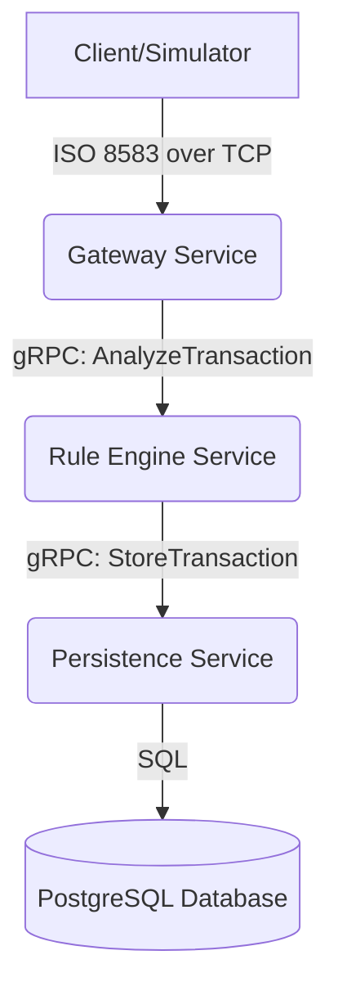

# 🛡️ Project Aegis: Real-time Transaction Risk Engine

[](https://golang.org/)
[](https://opensource.org/licenses/MIT)
[](https://github.com/)

Project Aegis is a rule-based transaction risk detection system built on a Go-based microservices architecture. It ingests financial transactions in ISO 8583 format through a socket connection, evaluates them in real-time against a configurable set of risk rules, and logs the results to a database for auditing and reporting purposes.

---

## ✨ Key Features

- **Microservice Architecture**: Decoupled services for high scalability and maintainability.
- **Real-time Processing**: Low-latency analysis of financial transactions as they occur.
- **ISO 8583 Native**: A dedicated TCP socket gateway for parsing standard financial transaction messages.
- **Configurable Rule Engine**: Risk rules are defined in an external YAML file, allowing for easy updates without recompiling the application.
- **High-Performance Communication**: Utilizes gRPC and Protocol Buffers for fast and strongly-typed inter-service communication.
- **Containerized**: Fully containerized with Docker and Docker Compose for easy setup and deployment.

---

## 🏛️ Architecture

The system is composed of three core microservices that communicate via gRPC.


---
### 🛠️ Tech Stack
Backend: Go
Inter-service Communication: gRPC, Protocol Buffers
Database: PostgreSQL
ISO 8583 Parsing: moov-io/iso8583
Containerization: Docker, Docker Compose
Configuration: YAML
---

### 🚀 Getting Started
Follow these instructions to get the project up and running on your local machine.

Prerequisites
- Go (version 1.22 or newer)
- Docker & Docker Compose
- protoc (Protocol Buffer compiler)
- make (optional, for convenience)

Installation & Running

1. Clone the repository:
```bash
git clone https://github.com/wirsal/project-aegis.git
cd project-aegis
```

2. Generate gRPC Code:
If you modify the .proto files, you will need to regenerate the Go code.
```bash
make proto
```

3. Run with Docker Compose:
This is the recommended way to run the project. It will build the Go binaries, and start all services along with a PostgreSQL database.
```bash
docker-compose up --build
```

The services will be available:

Gateway Service (TCP Socket): localhost:8583
Rule Engine Service (gRPC): localhost:50051
Persistence Service (gRPC): localhost:50052

4. Send a Test Transaction:
Use the provided simulator client to send a sample ISO 8583 message to the gateway.

```bash
# Navigate to the simulator directory (assuming you have one)
cd simulator

# Run the simulator
go run main.go
```
---

### ⚙️ Configuration
The risk rules can be easily configured in the config/rules.yaml file without changing any code.
Example config/rules.yaml:
```JSON
[
  {
    "rule_code": "HRMC1",
    "rule_type": "HRMC1",
    "rule_desc": "Transaksi High Risk Merchant Regular",
    "priority": 1,
    "status": 1,
    "org": "001;002;",
    "type": "001;002;011;012;101;102;121;122;141;142;152;191;192;201;202;203;213;221;222;225;233;252;301;302;303;304;305;352;401;402;403;404;405;406;407;501;502;599;601;602;704;801;802l",
    "block_code": "_;P;Q;V",
    "cr_limit": "1-1999999999",
    "merch_category": "0000;",
    "trans_code": "000;",
    "country_code": "I360;840",
    "currency_code": "I360;840",
    "amount": "0-1999999999",
    "pos_cond_code": "00;01;02;05;80;81;82;90;91",
    "resp_code": "00",
    "time_stamp": "000000-235959",
    "installment_ind": "-",
    "first_usage_flag": "-",
    "card_list": "",
    "desc": "-",
    "channel": "EMAIL,WA,SMS",
    "redaksional": "EM2,WA1,SM2687"
  },
]
```
---
### 📜 API Contract (gRPC)
The communication contracts between services are defined in protos/transaction.proto.

Example protos/transaction.proto snippet:
```proto
syntax = "proto3";

package risk;

option go_package = "api/protos";

message Transaction{
  string trxDate = 1;
  string trxTime = 2;
  string cardOrg = 3;
  string cardType = 4;
  string cardNumber = 5;
  string merchOrg = 6;
  string merchNumber = 7;
  string trxCode = 8;
  string trxReffNumber = 9;
  float  trxAmount = 10;
  string trxBillAmount = 11;
  string cardExpired = 12;
  string merchCategory = 13;
  string trxCountry = 14;
  string trxAuthCode = 15;
  string trxCardType = 16;
  string trxRespCode = 17;
  string trxMerchantName = 18;
  string trxPinCap = 19;
  string trxPosMode = 20;
  string trxPosData = 21;
  string trxStip = 22;
  string trxCvvResult = 23;
  string trxCvv2Result = 24;
  string trxCavResult = 25;
  string trxArqcResult = 26;
  string trxChipData = 27;
  string trxCurrency = 28;
  string trxInstallment = 29;
  string trxDeclineReason = 30;
  string trxTerminalId = 31;
  string trxMerchantId = 32;
  string trxAcqId = 33;
  string trxFwdId = 34;
  string trxChbCurr = 35;
  float trxOrgAmount = 36;
}

// Struktur untuk hasil evaluasi risiko
message RiskResult {
  string rrn = 1;
  enum RiskLevel {
    LOW = 0;
    MEDIUM = 1;
    HIGH = 2;
  }
  RiskLevel risk_level = 2;
  repeated string triggered_rules = 3;
  int32 risk_score = 4;
}

// Service untuk Rule Engine
service RuleEngine {
  rpc AnalyzeTransaction(Transaction) returns (RiskResult);
}

// Service untuk Persistence
service Persistence {
  rpc StoreTransaction(RiskResult) returns (StoreAck);
}

message StoreAck {
  bool success = 1;
  string message = 2;
}
```

---
🤝 Contributing
Contributions are welcome! Please feel free to submit a pull request.

Fork the Project

Create your Feature Branch (git checkout -b feature/AmazingFeature)

Commit your Changes (git commit -m 'Add some AmazingFeature')

Push to the Branch (git push origin feature/AmazingFeature)

Open a Pull Request

---