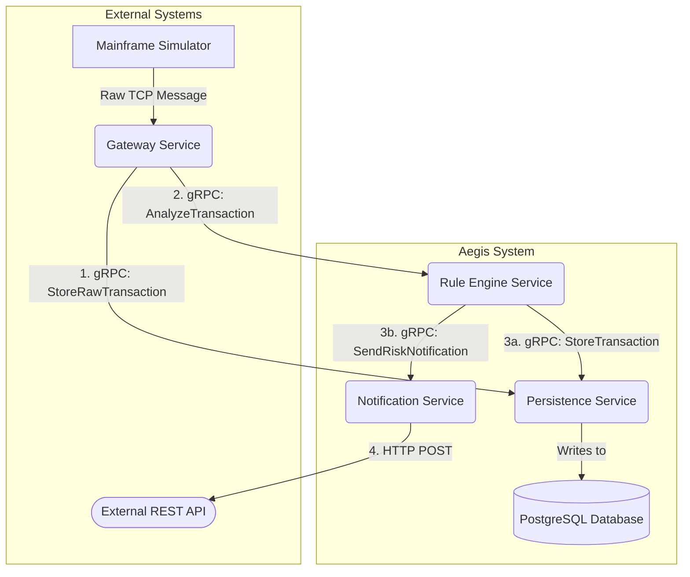

# 🛡️ Project Aegis: Real-time Transaction Risk Engine

[](https://golang.org/)
[](https://opensource.org/licenses/MIT)
[](https://github.com/)

Project Aegis is a high-performance risk detection system designed with a Go-based microservices architecture. It ingests complex financial transaction messages from a legacy mainframe environment via a raw TCP socket, parses the proprietary fixed-position format (including EBCDIC to ASCII translation), and evaluates them in real-time against a dynamic, data-driven rule set.

The system is composed of decoupled services that communicate via gRPC for high efficiency, with dedicated services for transaction ingestion, rule evaluation, data persistence, and external notifications.


---

## ✨ Key Features

- **Microservice Architecture**: Fully decoupled services (`Gateway`, `Rule Engine`, `Persistence`, `Notification`) for high scalability and independent deployment.
- **Custom Mainframe Message Parser**: A dedicated TCP gateway that handles raw byte streams and translates mixed EBCDIC/binary message formats to a modern structure.
- **Data-Driven & Prioritized Rule Engine**: Risk rules are loaded from an external JSON file, sorted by priority, and evaluated sequentially. The engine stops at the first matched rule for maximum efficiency.
- **High-Performance Communication**: Utilizes gRPC and Protocol Buffers for fast, strongly-typed, and efficient inter-service communication.
- **Asynchronous Persistence & Notification**: The system logs all incoming transactions and sends risk alerts without blocking the primary transaction analysis flow.
- **Centralized Configuration**: All service parameters (ports, addresses, DB credentials) are managed in a central `config.yaml` file using the Viper library.


---

## 🏛️ Architecture

The system is composed of three core microservices that communicate via gRPC.
The system consists of four primary microservices orchestrating the flow of a single transaction.

**Workflow**:

1. The Gateway Service receives a raw TCP message, parses it, and immediately calls the Persistence Service to log the raw transaction.
2. The Gateway then calls the Rule Engine Service to analyze the transaction.
3. If a rule is matched, the Rule Engine calls:
  a. The Persistence Service again to store the risk analysis result.
  b. The Notification Service.
4. The Notification Service sends an alert to an external RESTful API.

---
### 🛠️ Tech Stack
* **Backend**: Go
* **Inter-service Communication**: gRPC, Protocol Buffers
* **Database**: PostgreSQL (`lib/pq driver`) with sqlx
* **Configuration**: Viper (`config.yaml`)
* **Character Encoding**: `golang.org/x/text` (for EBCDIC to ASCII)
* **Deterministic ID**: SHA-256 Hashing (`crypto/sha256`) for Idempotency Keys
* **Containerization**: Docker, Docker Compose
---
### 📂 Project Structure
```text
project-aegis/
├── cmd/
│   ├── gateway/
│   ├── notification/
│   ├── persistence/
│   └── rule_engine/
│   ├── simulator/
├── configs/
│   ├── .config.yaml
│   └── .rules.json
├── internal/
│   ├── gateway/
│   ├── notification/
│   ├── persistence/
│   └── rule_engine/
├── pkg/
│   ├── codec/
│   ├── config/
│   └── parser/
├── api/
│   └── protos/
│       └── transaction.proto
├── go.mod
└── README.md
```

---
## 🚀 Getting Started
You can run the project using individual Go commands (for development) or with Docker Compose (recommended for a complete setup).

**Prerequisites**
- Go (version 1.22 or newer)
- Docker & Docker Compose
- `protoc` (Protocol Buffer compiler)
- A running PostgreSQL instance.

***Initial Setup***
1. **Clone the repository:**
```bash
    git clone https://github.com/wirsal/project-aegis.git
    cd project-aegis
```
2. **Generate gRPC Code:**
If you modify the `.proto` files, you will need to regenerate the Go code.
```bash
    make proto
```
3. **Setup Configuration Files:**
Copy the sample configuration files. You will need to edit .config.yaml with your actual database credentials.
```bash
    cp configs/config.sample.yaml configs/.config.yaml
    cp configs/rules.sample.json configs/.rules.json
```
### Method 1: Running Locally (Development)
Open a separate terminal for each service. Ensure your `configs/.config.yaml` is correctly set up.


1. **Terminal 1️⃣ - Run Persistence Service:**
```bash
    go run ./cmd/persistence/main.go
```
2. **Terminal 2️⃣ - Run Notification Service:**
```bash
    go run ./cmd/notification/main.go
```
3. **Terminal 3️⃣ - Run Rule Engine Service:**
```bash
    go run ./cmd/rule_engine/main.go
```
4. **Terminal 4️⃣ - Run Gateway Service:**
```bash
    go run ./cmd/gateway/main.go
```
5. **Terminal 5️⃣ - Send a Test Transaction:**
```bash
    # Navigate to the simulator directory
    cd simulator
    # Run the simulator
    go run main.go
```

### Method 2: Running with Docker Compose
(Recommended) This method will build and run all services, including a PostgreSQL database.
```bash
    docker-compose up --build
```
---


### ⚙️ Configuration
The application is managed by two main configuration files in the `/configs` directory.

`configs/.config.yaml`:

Manages service ports, addresses, and database credentials.
```yaml
  gateway:
    tcp_port: ":3333"
    rule_engine_address: "localhost:50051"

  rule_engine:
    grpc_port: ":50051"
    persistence_address: "localhost:50052"
    notification_address: "localhost:50053"

  persistence:
    grpc_port: ":50052"

  notification:
    grpc_port: ":50053"
    external_api_url: "https://httpbin.org/post"

  database:
    host: "localhost"
    port: "5432"
    user: "postgres"
    password: "yourpassword"
    dbname: "aegis_db"
```

`configs/.rules.json`

Defines the data-driven rules for the Rule Engine.
```json
  [
    {
      "rule_code": "HIGH-AMT-DOMESTIC",
      "priority": 1,
      "status": 1,
      "country_code": "I360",
      "amount": "10000000-999999999999",
      "...": "..."
    },
    {
      "rule_code": "FOREIGN-TRX",
      "priority": 5,
      "status": 1,
      "country_code": "E360",
      "amount": "0-999999999999",
      "...": "..."
    }
  ]
```
---
### 📜 API Contract (gRPC)
The communication contracts between all services are defined in `api/protos/transaction.proto`

```proto
  syntax = "proto3";

  package risk;

  option go_package = "github.com/wirsal/project-aegis/api/protos";

  // --- Messages ---

  message Transaction {
    string trxId = 1;
    string trxDate = 2;
    // ... many other fields
  }

  message RiskResult {
    string rrn = 1;
    enum RiskLevel {
      LOW = 0;
      MEDIUM = 1;
      HIGH = 2;
    }
    RiskLevel risk_level = 2;
    repeated string triggered_rules = 3;
    int32 risk_score = 4;
  }

  message StoreTransactionRequest {
    Transaction transaction_data = 1;
    RiskResult risk_data = 2;
  }

  message StoreAck { /* ... */ }
  message NotificationAck { /* ... */ }


  // --- Services ---

  service RuleEngine {
    rpc AnalyzeTransaction(Transaction) returns (RiskResult);
  }

  service Persistence {
    rpc StoreRawTransaction(Transaction) returns (StoreAck);
    rpc StoreTransaction(StoreTransactionRequest) returns (StoreAck);
  }

  service Notification {
    rpc SendRiskNotification(RiskResult) returns (NotificationAck);
  }
```

---
🤝 Contributing
Contributions are welcome! Please feel free to submit a pull request.

1. Fork the Project
2. Create your Feature Branch (`git checkout -b feature/AmazingFeature`)
3. Commit your Changes (`git commit -m 'Add some AmazingFeature'`)
4. Push to the Branch (`git push origin feature/AmazingFeature`)
5. Open a Pull Request

---