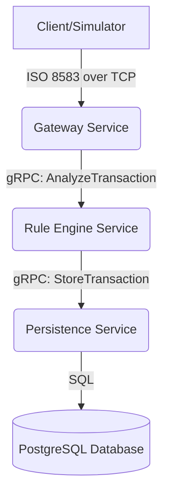

# 🛡️ Project Aegis: Real-time Transaction Risk Engine

[](https://golang.org/)
[](https://opensource.org/licenses/MIT)
[](https://github.com/)

Project Aegis is a rule-based transaction risk detection system built on a Go-based microservices architecture. It ingests financial transactions in ISO 8583 format through a socket connection, evaluates them in real-time against a configurable set of risk rules, and logs the results to a database for auditing and reporting purposes.

---

## ✨ Key Features

- **Microservice Architecture**: Decoupled services for high scalability and maintainability.
- **Real-time Processing**: Low-latency analysis of financial transactions as they occur.
- **ISO 8583 Native**: A dedicated TCP socket gateway for parsing standard financial transaction messages.
- **Configurable Rule Engine**: Risk rules are defined in an external YAML file, allowing for easy updates without recompiling the application.
- **High-Performance Communication**: Utilizes gRPC and Protocol Buffers for fast and strongly-typed inter-service communication.
- **Containerized**: Fully containerized with Docker and Docker Compose for easy setup and deployment.

---

## 🏛️ Architecture

The system is composed of three core microservices that communicate via gRPC.


---
### 🛠️ Tech Stack
Backend: Go
Inter-service Communication: gRPC, Protocol Buffers
Database: PostgreSQL
ISO 8583 Parsing: moov-io/iso8583
Containerization: Docker, Docker Compose
Configuration: YAML
---

### 🚀 Getting Started
Follow these instructions to get the project up and running on your local machine.

Prerequisites
- Go (version 1.22 or newer)
- Docker & Docker Compose
- protoc (Protocol Buffer compiler)
- make (optional, for convenience)

Installation & Running

1. Clone the repository:
```bash
git clone https://github.com/wirsal/project-aegis.git
cd project-aegis
```

2. Generate gRPC Code:
If you modify the .proto files, you will need to regenerate the Go code.
```bash
make proto
```

3. Run with Docker Compose:
This is the recommended way to run the project. It will build the Go binaries, and start all services along with a PostgreSQL database.
```bash
docker-compose up --build
```

The services will be available:

Gateway Service (TCP Socket): localhost:8583
Rule Engine Service (gRPC): localhost:50051
Persistence Service (gRPC): localhost:50052

4. Send a Test Transaction:
Use the provided simulator client to send a sample ISO 8583 message to the gateway.

```bash
# Navigate to the simulator directory (assuming you have one)
cd simulator

# Run the simulator
go run main.go
```
---

### ⚙️ Configuration
The risk rules can be easily configured in the config/rules.yaml file without changing any code.
Example config/rules.yaml:
```yaml
rules:rules:
  - name: "HighAmountTransaction"
    description: "Transaction amount exceeds the high-value threshold."
    field: "amount"
    operator: "greater_than"
    value: 5000000
    risk_score: 50
  - name: "ManualCardEntry"
    description: "POS entry mode indicates manual key-in, which is riskier."
    field: "pos_entry_mode"
    operator: "equals"
    value: "012" # Code for manual entry
    risk_score: 30
  - name: "LateNightTransaction"
    description: "Transaction occurs during unusual hours."
    field: "transaction_time" # HHMMSS format
    operator: "between"
    value: ["010000", "040000"]
    risk_score: 20
```
---
### 📜 API Contract (gRPC)
The communication contracts between services are defined in protos/transaction.proto.

Example protos/transaction.proto snippet:
```proto
syntax = "proto3";

package risk;

option go_package = "[github.com/wirsal/project-aegis/protos](https://github.com/wirsal/project-aegis/protos)";

// A financial transaction
message Transaction {
  string rrn = 1;
  string pan = 2; // Should be masked
  int64 amount = 3;
  string terminal_id = 4;
  string pos_entry_mode = 5;
  string transaction_time = 6; // HHMMSS
}

// Result of the risk analysis
message RiskResult {
  string rrn = 1;
  enum RiskLevel {
    LOW = 0;
    MEDIUM = 1;
    HIGH = 2;
  }
  RiskLevel risk_level = 2;
  repeated string triggered_rules = 3;
  int32 risk_score = 4;
}

// Rule Engine Service Definition
service RuleEngine {
  rpc AnalyzeTransaction(Transaction) returns (RiskResult);
}
```

---
🤝 Contributing
Contributions are welcome! Please feel free to submit a pull request.

Fork the Project

Create your Feature Branch (git checkout -b feature/AmazingFeature)

Commit your Changes (git commit -m 'Add some AmazingFeature')

Push to the Branch (git push origin feature/AmazingFeature)

Open a Pull Request

---